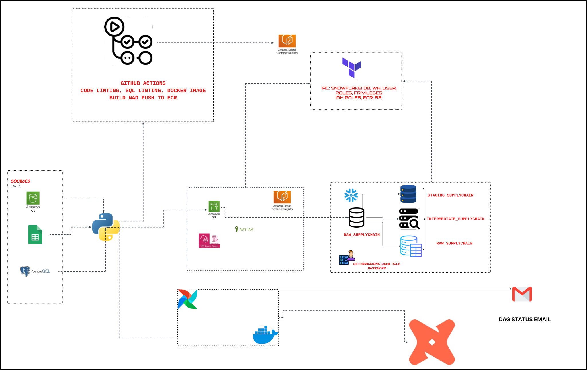

# LAUNCHPAD-CAPSTONE PROJECT
### **PROJECT FOLDERS**
- [.github](.github/) → Github actions worflows
- [config](config/) → Contains Airflow config file
- [dags](dags/) → Dags folder for pipeline orchestration
- [dbt_SupplyChain360](dbt_SupplyChain360/) → dbt folder for data modelling
- [infrastructure](infrastructure/) → IAC for SupplyChain360
- [logs](logs/) → Contains log file configuration
- [tests](tests/) → Tests for .py files
- [.dockerignore](.dockerignore) → Files Docker ignores
- [.gitattributes](.gitattributes) → .py files formatting matching Linus EOF
- [.sqlfluff](.sqlfluff) → SQL linting file for dbt
- [.sqlfluffignore](.sqlfluffignore) → Folders/ files sqlfluff should ignore
- [ docker-compose.yml](docker-compose.yml) → Compose file for dags
- [Dockerfile](Dockerfile) → Dockerfile
- [pyproject.toml](pyproject.toml) → Ruff linting
- [pytest.ini](pytest.ini) → Pytest file config to match parent directory
- [requirements.txt](requirements.txt) → Project requirements

### **PROBLEM STATEMENT**
**SupplyChain360 currently suffers from severe operational inefficiencies due to data fragmentation. Critical supply chain data—including inventory snapshots, logistics logs, and sales transactions—is siloed across AWS S3, Google Sheets, and PostgreSQL. The lack of a centralized "source of truth" has resulted in frequent product stockouts, inefficient warehouse utilization, and delayed supplier deliveries.This project aims to solve these challenges by engineering a Unified Supply Chain Data Platform that automates the ingestion, cleaning, and modeling of cross-domain data to enable real-time, actionable insights for inventory optimization and supplier performance.**

### **SOLUTION ARICHECTURE**


**DATA SOURCES**
| Source        | Description                                                      |
| ------------- | ---------------------------------------------------------------- |
| S3 bucket     | Contains folders: inventory, products, warehouses, shipments, suppliers |
| Postgres DB   | Sales data                                                       |
| Google Sheets | Information about stores                                         |

To ensure modularity, maintainability, and efficient collaboration, the project is organized into dedicated branches, each focusing on a specific aspect of the workflow:

- ingest: Contains all Python code related to data ingestion, including scripts for interacting with AWS S3, Google Sheets, and PostgreSQL using the boto3 library and other connectors.

- infra: Manages Infrastructure as Code (IaC) for provisioning and configuring cloud resources required by the platform.

- modelling: Focuses on data modeling, transformation logic, and dbt project files for building analytics-ready datasets.

- dev: Serves as the main integration branch, where code from all feature branches is merged for linting, DAG definition, and end-to-end testing before deployment.
This branching strategy promotes separation of concerns, simplifies code reviews, and enables parallel development across different components of the project.

### **Provisioned Infrastruture**
Top-Level Files
- backend.tf
Configures the backend for storing Terraform state remotely (in an S3 bucket).
- iam.tf
Defines IAM roles, users, and policies required for the platform (e.g. for S3 access, pipeline execution, ecr, ssm parameter).
- locals.tf
Contains local variables used throughout the Terraform configuration for better resources maintainability.
- main.tf
The main entry point that ties together resources and modules.
- output.tf
Specifies output values to display after Terraform applies (e.g., resource ARNs, bucket names).
- provider.tf
Configures my region and source credentials for reading ssm parameters and writing to mine
- variables.tf
Declares input variables for parameterizing the infrastructure.
- version.tf
Specifies the required Terraform version and provider versions.

**`module/s3/`**
- main.tf
Defines the S3 bucket(s) used for data storage, including configuration for versioning, encryption, and lifecycle management.
- variables.tf
Input variables for customizing the S3 module (e.g., bucket name, region).
- output.tf
Outputs relevant S3 resource information (e.g., bucket name, ARN).

**`module/snowflake/`**
main.tf
Provisions Snowflake resources such as databases, schemas, roles, and users.
variables.tf
Input variables for customizing the Snowflake module (e.g database name, user).
output.tf
Outputs relevant Snowflake resource information (e.g database name, user).
versions.tf
Specifies the required provider version for Snowflake.

### **Ingestion Mechanism:**
#### Helper files
 `Utility.py`
- `get_aws_dst_params(conn_id="aws_dst")`:
Retrieves AWS credentials and bucket information from an Airflow connection.
- `time_stamp()` / `full_timestamp()`:
Utility functions for generating timestamps for metadata and unique file naming.
- `parquet_path(folder, filename):
Constructs a unique S3 key for Parquet files using the folder, filename, and timestamp.

`Write.py`
- `object_metadata(data_source, df)`:
Adds extraction date and origin metadata to a DataFrame(e.g sheets, rds, s3 as origin)
- `get_dest_s3_client(conn_id="aws_dst")`:
Returns a boto3 S3 client for the destination bucket using Airflow credentials.
- `write_parquet(df, data_source, folder, filename, conn_id="aws_dst")`:
Converts a DataFrame to Parquet format and uploads it to the destination S3 bucket.

**S3 objects Extraction (s3_to_s3.py)**
S3 Buckets data extraction: Data extraction from this bucket utilised boto3 , airflow to securely store credentials at runtime.

- `S3ClientFactory` (Class)
  - `create_client(conn_id)`:
Static method to create a boto3 S3 client using credentials and region from an Airflow connection.

- `MoveData` (Class)
  - `__init__(src_client, dst_client, src_bucket, dst_bucket)`:
Initializes the class with source/destination S3 clients and bucket names.
  - `validate_folders(source)`:
Scans the source bucket for folders and file types under a given prefix.
  - `exists_by_basename(prefix, base)`:
Checks if a file with a given base name exists in the destination bucket.
  - `read_json_file(s3_key)`:
Reads a JSON file from S3 and returns a pandas DataFrame.
  - `read_csv_file(s3_key)`:
Reads a CSV file from S3 and returns a pandas DataFrame.
  - `process_csv_files(prefi)`:
Processes all CSV files under a given prefix in the source bucket.
  - `process_json_files(prefix)`:
Processes all JSON files under a given prefix in the source bucket.
  - `ingest_files(source)`:
Orchestrates the ingestion of files from the source to the destination bucket, converting them to Parquet format.

### **How tht functions work together**
S3ClientFactory creates S3 clients using credentials stored in Airflow.
MoveData validates, processes and checks for file existencein the source bucket, reading them as DataFrames.
  - If the object exists, no processing is done on the object i.e a skipping mechanism is applied
  - Files are converted to Parquet format with metadata using write_parquet and uploaded to the destination bucket.
  - Utility functions handle credential retrieval, timestamping, and S3 key generation.
  - On the event of a netwrok issue, the trial mechansims kickc in to preven the pipelin from failing abruptly

**Google Sheets Extraction (sheets.py)**
This module provides classes and methods for extracting data from Google Sheets and ingesting it into an S3 bucket, leveraging Airflow for credential management and logging.

Key Classes and Functions
- `SheetsManager` (Class)
Manages the connection to a Google Sheet using Airflow's GSheetsHook and the gspread library.
  - __init__(sheet_url=None, gcp_conn_id="gspred_credentials"):
Initializes the manager with the sheet URL and credentials. If no URL is provided, it uses the SHEETS_URL Airflow variable.
get_dataframe():
Fetches all values from the first worksheet and returns them as a pandas DataFrame.

- `SheetsParser` (Class)
Handles the ingestion of data from a Google Sheet into an S3 bucket.
  - _`_init__(dst_client, dst_bucket)`:
Initializes the parser with a destination S3 client and bucket.
  - `ingest_data(source, sheet_manager, df)`:
Uploads the provided DataFrame to S3 as a Parquet file, skipping the upload if the file already exists. Handles errors and logs the process.

#### **Workflow Overview**
`SheetsManager` connects to a Google Sheet and retrieves its data as a DataFrame.
`SheetsParser` checks if the data already exists in the destination S3 bucket.
The data is uploaded to S3 in Parquet format using the write_parquet utility.
All operations are logged for traceability and error handling.

**Sales tables extraction(postgres.py)**
This module handles extracting data from a Postgres database hosted on aws and writing it to the destination S3 bucket as Parquet files.

**Key Functions and Workflow:**
- `Postgres class`
  - connect_rds: Establishes a connection to the RDS instance using Airflow’s PostgresHook.
  - get_table_names: Retrieves all table names from the database using a SQL script.
  - ingest_data: For each table, fetches data in batches, concatenates the results, and writes the final DataFrame to S3 as a Parquet file (using `write_parquet` in write.py). Handles retries and logs progress.

**Data Warehousing (`s3_to_snowflake.py`)**
This module is responsible for loading data from the destination S3 bucket into Snowflake. It assumes that all data extraction from sources (Google Sheets, Postgres, and source S3 buckets) has already been performed and the resulting data is available as Parquet files in the destination S3 bucket.

Key Functions
`SnowFlake` class:
Central class for orchestrating the S3-to-Snowflake pipeline.
Initialization: Loads Snowflake credentials from Airflow and sets up S3 client and bucket.
  - conn_sf: Establishes a connection to Snowflake using Airflow-managed credentials.
  - get_directories / get_parquet_files_in_dir: Lists all relevant directories and Parquet files in the S3 bucket.
  - get_df: Downloads a Parquet file from S3 and loads it into a pandas DataFrame.
  - parquet_dtypes_to_snowflake / get_columns_sql: Maps DataFrame dtypes to Snowflake SQL types and generates column definitions.
  - table_exists / create_table / create_staging_table: Checks for and creates target and staging tables in Snowflake.
  - create_processed_files_table / is_file_processed / mark_file_processed: Implements idempotency by tracking processed files in a dedicated Snowflake table.
  - upsert_batches: Efficiently upserts data from DataFrames into Snowflake tables in batches using staging tables and MERGE statements.
  - process_file / process_directory / create_tables_from_directories: Orchestrates the end-to-end process of reading, deduplicating, and upserting all new Parquet files from S3 into Snowflake, with retries and logging.

**Main Flow**
The main.py script serves as the entry point for the data ingestion pipeline. It orchestrates the end-to-end workflow by sequentially invoking the main extraction, transformation, and loading functions from the project’s core modules.

Workflow:
- S3 to S3 Ingestion:
Uses MoveData to extract and transfer files from the source S3 bucket to the destination S3 bucket.
- Google Sheets Extraction:
Utilizes SheetsManager to fetch data from Google Sheets and SheetsParser to ingest it into the destination S3 bucket.
- Postgres Extraction:
Instantiates the Postgres class to extract data from the Postgres database and write it to the destination S3 bucket.
- S3 to Snowflake Loading:
Uses the SnowFlake class to scan the destination S3 bucket and load new data into Snowflake tables.

Data Transformation Overview (dbt_SupplyChain360)
This directory contains all dbt (Data Build Tool) assets for transforming raw data into analytics-ready tables in Snowflake for SupplyChain360

**STAGING MODELS**
| File Name            | Description                                               |
|----------------------|-----------------------------------------------------------|
| stg_inventory.sql    | Cleans and standardizes raw inventory data from the source. |
| stg_products.sql     | Cleans and standardizes raw product data.                 |
| stg_warehouses.sql   | Prepares warehouse data for downstream use.               |
| stg_shipments.sql    | Cleans shipment records from the raw layer.               |
| stg_suppliers.sql    | Standardises supplier information.                        |
| stg_stored.sql       | Standardises stores information.                          |
| stg_transactions.sql | Standardises information about stores.                    |

**INTERMEDIATE MODELS**
| File Name | Description                                                            |
|-----------|------------------------------------------------------------------------|
| int_inventory_health.sql | Classifies inventory as Below reorder threshold, Stock-Out, Healthy, Sufficient |
| int_shipments_performance.sql | Classifies the timeliness of shipements: Early, Late, On-time|
| int_supplier_products.sql |  Join on both suppliers and products table|
| int_transactions_enriched.sql | Check which products cause losses, profits etc |
| int_warehouse_to_store_efficiency.sql | Classifies warehouses and stores according to locations|

**MARTS MODELS**
| File Name |
|-----------|
| dim_products.sql |
| dim_stores.sql |
| dim_supplier.sql |
| dim_warehouses.sql |
| fct_inventory.sql |
| fct_regional_sales.sql |
| fct_transactions.sql |
| fct_warehouse_efficiency.sql |


**Orchestration**
Airflow orchestrates the entire data pipeline using a modular DAG defined in orchestrate.py. The workflow is organized into clear stages—extraction, snapshot, staging, intermediate, and mart—each represented as a task or task group. The pipeline:

**extract** data from all sources (S3, Google Sheets, Postgres) by calling the main ingestion script.
**Runs dbt snapshots** to capture slowly changing dimensions.
**Executes dbt models** in the staging, intermediate, and mart layers, with tests after each run to ensure data quality.
**Sends email notifications on success or failure.**

**Prerequisites**
- AWS Account:
Required for S3, IAM, and other AWS resources.
- Snowflake Account:
For data warehousing and analytics.
- Google Cloud Project:
For Google Sheets API access with SHEETS API access enabled and google drive
- Terraform:
Used for Infrastructure as Code (IaC). Install Terraform
- Python >= 3.11
For running Airflow, ingestion scripts, and dbt.

**AIRFLOW CREDENTIALS**
```yaml
Conn Id: aws_src
Conn Type: Amazon Web Services
Login: SRC_ACCESS_KEY
Password: SRC_SECRET_KEY
Extra: {"region": "SRC_REGION", "bucket": "SRC_BUCKET"}

Conn Id: snowflake_conn
Conn Type: Snowflake
Account: SNOWFLAKE ACCOUNT
Login: SNOWFLAKE USERNAME
Password: SNOWFLAKE PASSWORD
Warehouse: SNOWFLAKE DATAWAREHOUSE
Database: SNOWFLAKE DB
Schema: SNOWFLAKE SCHEMA
Role: SNOWFLAKE ROLE

Conn Id: postgres_conn
Conn Type: Postgres
Host: DB HOST
Schema: DB NAME
Login: DB USER
Password: DB PASSWORD
Port: DB PORT

Conn Id: gspread_credential
Conn Type: Google Cloud
KeyFile JSON: credentials.json file
Scopes: "https://www.googleapis.com/auth/spreadsheets","https://www.googleapis.com/auth/drive"

Conn Id: aws_dst
Conn Type: Amazon Web Services
Login: DST_ACCESS_KEY
Password: DST_SECRET_KEY
Extra: {"region": "DST_REGION", "bucket": "DST_BUCKET"}

ALSO SET UP A VARIABLE FOR SHEETS URL
```
**TESTS**
| File Name         | Description                                              |
|-------------------|---------------------------------------------------------|
| test_postgres.py  | Tests Postgres extraction and S3 writing logic.          |
| test_s3_to_s3.py  | Tests S3-to-S3 data movement and validation functions.   |
| test_sheets.py    | Tests Google Sheets extraction and ingestion.            |
| test_utility.py   | Tests utility functions (e.g., timestamp, path helpers). |
| test_write.py     | Tests Parquet writing and S3 upload logic.               |

**CI/CD PIPELINE**
| File Name         | Description                                             |
|-------------------|--------------------------------------------------------|
| ci_pipeline.yml   | Runs automated tests and code linting - Python and SQL on every push or PR.  |
| cd_pipeline.yaml  | Builds, pushes Docker images, and deploys to AWS ECR.  |


**Feedback, suggestions, and improvements is welcomed. If you find an issue or have an idea to enhance this project, feel free to open an issue or start a discussion.**